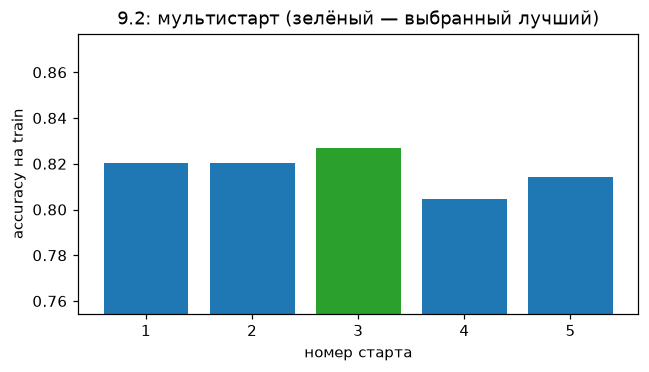
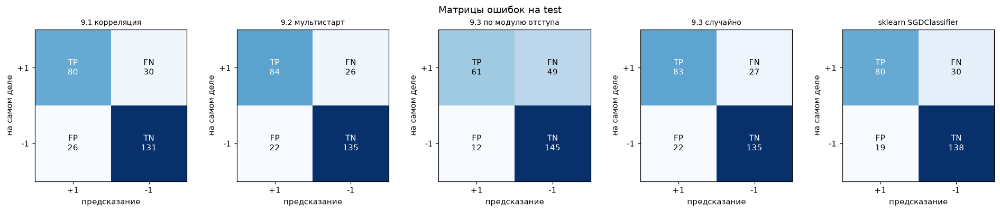
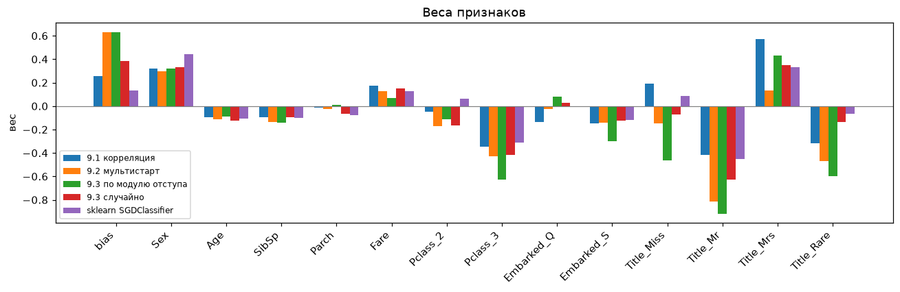

# Лабораторная работа №1. Линейная классификация

Линейный классификатор $a(x) = \mathrm{sign}\langle w, x\rangle$ с квадратичной функцией потерь, обученный стохастическим градиентным спуском (SGD) с инерцией и L2-регуляризацией. Сравниваются способы инициализации весов (корреляция, мультистарт) и предъявления объектов (случайное, по модулю отступа); лучшая реализация сравнивается с `sklearn.linear_model.SGDClassifier`.

## Запуск

```sh
cd source
uv sync
uv run python main.py
```

Датасет скачивается автоматически при первом запуске. Скрипт печатает все таблицы, приведённые ниже, и перерисовывает графики в `images/`. Случайность зафиксирована (`np.random.seed(42)`), поэтому результаты воспроизводятся.

## Структура кода

| файл | содержимое |
|---|---|
| `source/data_preprocessing.py` | загрузка и подготовка датасета, разбиение train/test, стандартизация |
| `source/model.py` | отступ, функция потерь, градиент, рекуррентная оценка Q, L2, скорейший спуск, предъявление по отступу, SGD с инерцией |
| `source/initialization.py` | инициализация весов (корреляция, случайная), стартовое значение Q |
| `source/task.py` | эксперименты 9.1, 9.2, 9.3 |
| `source/metric.py` | accuracy, матрица ошибок, precision / recall / F1, ROC |
| `source/sklearn_baseline.py` | эталонная реализация |
| `source/report.py` | вывод таблиц и графиков |
| `source/main.py` | запуск всех экспериментов |

## 1. Датасет

**Titanic** (Kaggle): 891 пассажир, задача — предсказать, выжил ли пассажир (`Survived`). Погибли 549 (62%), выжили 342 (38%). Женщин выжило 74%, мужчин — 19%; в 1-м классе — 63%, во 2-м — 47%, в 3-м — 24%.

Подготовка данных:

1. Метки классов переведены в $\lbrace -1, +1 \rbrace$ ($-1$ — погиб, $+1$ — выжил).
2. Пол закодирован числом: `male` → 0, `female` → 1.
3. Из имени извлечено обращение (`Mr`, `Mrs`, `Miss`, `Master`); редкие (`Dr`, `Rev`, `Col`, …) объединены в `Rare`.
4. Пропуски: `Embarked` (2 шт.) — самым частым значением; `Age` (177 шт.) — медианой по группе (обращение, класс, пол).
5. Удалены `PassengerId`, `Ticket`, `Name`, `Cabin` (77% пропусков).
6. `Pclass`, `Embarked`, `Title` — one-hot с `drop_first=True`. Удалены базовые категории `Pclass_1`, `Embarked_C`, `Title_Master`: иначе сумма столбцов каждой группы равна 1 и совпадает со столбцом bias, и веса становятся неоднозначными.
7. Добавлен столбец `bias` из единиц.
8. Разбиение 70/30: 624 объекта в train, 267 в test.
9. `Age` (до 80) и `Fare` (до 512) стандартизированы: $x \to (x - \mu)/\sigma$, где $\mu, \sigma$ считаются только по train. Без этого шаг градиента по этим признакам в десятки–сотни раз больше, чем по признакам 0/1, и обучение неустойчиво.

Итоговые признаки (14 с bias): `bias, Sex, Age, SibSp, Parch, Fare, Pclass_2, Pclass_3, Embarked_Q, Embarked_S, Title_Miss, Title_Mr, Title_Mrs, Title_Rare`.

## 2–8. Реализация

**Отступ (п. 2)** — `calculate_margin`: $M_i = y_i \langle w, x_i \rangle$. $M_i > 0$ — объект классифицирован верно, $M_i < 0$ — ошибка; $|M_i|$ — уверенность (удалённость от разделяющей границы).

**Функция потерь** — `calculate_loss`: $\mathcal{L}(M) = (1 - M)^2$.

**Градиент (п. 3)** — `calculate_gradient`: $\nabla_w \mathcal{L} = -2(1 - M_i) y_i x_i$.

**Рекуррентная оценка функционала качества (п. 4)** — `calculate_q`: $Q := \lambda \varepsilon_i + (1 - \lambda) Q$, где $\varepsilon_i$ — потеря на текущем объекте. Это экспоненциальное скользящее среднее по примерно $1/\lambda$ последним объектам. Начальное $Q$ — средняя потеря на 50 случайных объектах (`calculate_q_start`).

**SGD с инерцией (п. 5)** — `calculate_sgd`: $v := \gamma v + h\nabla$, $w := w - v$.

**L2-регуляризация (п. 6)** — `calculate_l2`: к градиенту добавляется $\tau w$ (вес bias не штрафуется).

**Скорейший градиентный спуск (п. 7)** — `calculate_h`: шаг $h^{\ast}$ выбирается так, чтобы после обновления отступ текущего объекта стал равен 1 (минимум потерь):

```math
y_i \langle w - h^{\ast}\nabla, x_i\rangle = 1 \quad \Rightarrow \quad h^{\ast} = \frac{M_i - 1}{y_i \langle \nabla, x_i \rangle}
```

Такой шаг полностью подгоняет веса под один объект, и при обучении на всей выборке веса «прыгают» под каждый новый объект (accuracy на train колебалась от 0.37 до 0.80). Поэтому используется доля этого шага: $h = \eta h^{\ast}$.

**Предъявление по модулю отступа (п. 8)** — `calculate_p`: $p_i \propto 1 / (|M_i| + \epsilon)$, чаще выбираются объекты у границы классов. Вероятности пересчитываются раз в 100 шагов.

**Остановка:** раз в эпоху (624 шага) $Q$ сравнивается со значением эпоху назад; если изменение $\le$ `tolerance` три эпохи подряд — стоп. Страховочный лимит — $10^5$ шагов. Сравнение соседних шагов не подходит: их разница $\lambda(\varepsilon_i - Q)$ зависит от одного случайного объекта.

### Гиперпараметры

| параметр | значение | смысл |
|---|---|---|
| `learning_rate` $\eta$ | 0.01 | доля от шага скорейшего спуска |
| `tolerance` | 0.01 | порог изменения $Q$ за эпоху |
| `q_update_rate` $\lambda$ | 0.001 | $Q$ усредняет ~1000 последних объектов |
| `momentum` $\gamma$ | 0.5 | инерция |
| `l2_strength` $\tau$ | 0.001 | коэффициент L2 |
| `n_starts` | 5 | запусков в мультистарте |

$\eta$ и `tolerance` выбраны перебором (5 × 4 значений, для каждой пары — все 4 метода по 3 seed), выбор по accuracy **на train**:

| $\eta$ | tolerance | train, среднее | train, худший–лучший | время |
|---|---|---|---|---|
| 0.1 | 0.01 | 0.803 | 0.697–0.837 | 37 с |
| 0.03 | 0.01 | 0.819 | 0.771–0.840 | 22 с |
| 0.01 | 0.005 | 0.827 | 0.801–0.838 | 46 с |
| **0.01** | **0.01** | **0.821** | **0.803–0.838** | **12 с** |
| 0.01 | 0.05 | 0.808 | 0.795–0.833 | 3 с |
| 0.003 | 0.01 | 0.807 | 0.795–0.838 | 11 с |
| 0.001 | 0.01 | 0.805 | 0.790–0.841 | 8 с |

Большой шаг ($\eta = 0.1$) иногда проваливается до 0.68–0.70, маленький ($\eta \le 0.003$) не успевает доучиться. $\eta = 0.01$ даёт высокое среднее и самый узкий разброс; `tolerance = 0.01` почти не уступает 0.005 и в 4 раза быстрее. `q_update_rate = 0.001` выбран потому, что при 0.1 оценка $Q$ сильно «шумела» и по ней нельзя было определить момент остановки.

## 9. Обучение

- **9.1 — инициализация через корреляцию** (`calculate_w_correlation`): $w_j = \langle y, f_j \rangle / \langle f_j, f_j \rangle$ — каждый признак «голосует» согласно своей связи с ответом.
- **9.2 — случайная инициализация + мультистарт** (`calculate_w_random`, `run_multistart`): веса из $U\left(-\frac{1}{2n}, \frac{1}{2n}\right)$, 5 запусков, выбирается лучший по accuracy на train. Accuracy на train по запускам: 0.821, 0.821, **0.827**, 0.804, 0.814.
- **9.3 — предъявление по модулю отступа vs случайное** (`run_sampling_comparison`): оба варианта стартуют с одних и тех же случайных весов.



### Отступы


Объекты отсортированы по отступу. Красная зона ($M<0$) — ошибки, жёлтая ($0 \le M < 1$) — верные ответы у границы классов, зелёная ($M \ge 1$) — уверенно верные. Левый «хвост» с большим отрицательным отступом — пассажиры, нетипичные для своей группы (например, выжившие мужчины 3-го класса): линейная модель на них уверенно ошибается.

У всех методов ошибается примерно каждый пятый объект. При предъявлении по модулю отступа зелёная зона на train шире (модель увереннее на обучающих объектах), но ошибок на test больше: 61 против 49 при случайном предъявлении.

## 10. Оценка качества

Все метрики, кроме `acc train`, — на test.

| метод | acc train | acc test | precision | recall | F1 | AUC | итераций |
|---|---|---|---|---|---|---|---|
| 9.1 корреляция | 0.801 | 0.790 | 0.755 | 0.727 | 0.741 | 0.874 | 5 616 |
| **9.2 мультистарт** | 0.827 | **0.820** | 0.793 | **0.764** | **0.778** | **0.885** | 42 432 |
| 9.3 по модулю отступа | 0.811 | 0.772 | **0.836** | 0.555 | 0.667 | 0.865 | 18 720 |
| 9.3 случайно | 0.825 | 0.817 | 0.791 | 0.755 | 0.772 | 0.883 | 18 096 |
| sklearn SGDClassifier | 0.819 | 0.817 | 0.808 | 0.727 | 0.766 | 0.874 | 42 эпохи |



Строки — истинный класс, столбцы — ответ модели. У предъявления по модулю отступа FN = 49: модель пропускает почти половину выживших (recall 0.55), но, когда отвечает «выжил», почти всегда права (precision 0.84).


ROC-кривые всех методов почти совпадают (AUC 0.865–0.885): модели одинаково хорошо упорядочивают пассажиров по баллу $\langle w, x \rangle$. Низкая accuracy у предъявления по отступу при близком AUC означает, что порядок объектов у этой модели правильный, а граница (порог 0) смещена в сторону ответа «погиб».

## Анализ весов



Положительный вес сдвигает балл к «выжил», отрицательный — к «погиб». Веса сравнимы между собой: `Age` и `Fare` стандартизированы (вес — эффект отклонения на одно стандартное отклонение: ≈ 13.4 года и ≈ 51 фунт), остальные признаки — 0/1 или небольшие счётчики. Веса one-hot признаков показывают отличие от базовой категории (`Pclass_1`, `Embarked_C`, `Title_Master`).

Веса лучшей модели (9.2):

| признак | вес | интерпретация |
|---|---|---|
| `bias` | +0.63 | «базовый» пассажир — мальчик (`Master`) 1-го класса из Cherbourg без родственников, среднего возраста и со средней ценой билета — скорее выжил |
| `Sex` | +0.30 | женщины выживали чаще |
| `Age` | −0.11 | старше на ~13 лет — немного ниже шанс |
| `SibSp` | −0.14 | каждый брат/сестра/супруг на борту снижает шанс |
| `Parch` | −0.02 | почти не влияет |
| `Fare` | +0.13 | дороже билет — выше шанс |
| `Pclass_2` | −0.17 | 2-й класс немного хуже 1-го |
| `Pclass_3` | −0.43 | 3-й класс заметно хуже 1-го |
| `Embarked_Q` | −0.03 | ≈ Cherbourg |
| `Embarked_S` | −0.14 | Southampton хуже Cherbourg |
| `Title_Miss` | −0.15 | см. ниже |
| `Title_Mr` | −0.81 | взрослые мужчины — самый сильный отрицательный фактор |
| `Title_Mrs` | +0.13 | замужние женщины |
| `Title_Rare` | −0.47 | редкие обращения (в основном мужчины: офицеры, священники, доктора) |

Пример: мужчина `Mr`, 3-й класс, Southampton, дешёвый билет (−0.5σ): $0.63 - 0.43 - 0.81 - 0.14 - 0.07 \approx -0.82$ → «погиб». Женщина `Mrs`, 1-й класс, Cherbourg, дорогой билет (+1σ): $0.63 + 0.30 + 0.13 + 0.13 \approx +1.19$ → «выжила».

Знаки `bias`, `Sex`, `Age`, `SibSp`, `Fare`, `Pclass_3`, `Embarked_S`, `Title_Mr`, `Title_Rare` совпадают у всех пяти моделей, включая sklearn. Веса `Title_Miss`, `Title_Mrs`, `Embarked_Q` различаются между методами даже по знаку при почти одинаковом качестве (например, `Title_Miss`: +0.19 у 9.1, −0.15 у 9.2, +0.09 у sklearn). Причина — пересекающиеся признаки: `Miss`/`Mrs` всегда означают `Sex = 1`, `Mr` — `Sex = 0`, и одно и то же предсказание получается разными комбинациями весов. Слабая L2-регуляризация ($\tau = 10^{-3}$) лишь немного ограничивает этот выбор.

## 11. Сравнение с эталоном

`SGDClassifier(loss='squared_error', penalty='l2', alpha=1e-3, fit_intercept=False, learning_rate='adaptive', eta0=0.001)` — та же функция потерь и регуляризация; bias уже в данных. С темпом обучения по умолчанию веса sklearn расходились до $\sim 10^{12}$, поэтому `eta0` подобран отдельно. Значения `eta0` и нашего $\eta$ напрямую не сравнимы: у нас $\eta$ — доля шага скорейшего спуска, у sklearn `eta0` умножает градиент.

Лучшая реализация (9.2, мультистарт): accuracy 0.820, F1 0.778, AUC 0.885 против 0.817 / 0.766 / 0.874 у sklearn — на уровне эталона.

## Дополнительно: влияние инерции

Один и тот же случайный старт, по 3 запуска на каждое значение $\gamma$:

| $\gamma$ | acc train | acc test | итераций |
|---|---|---|---|
| 0 | 0.805 | 0.811 | 13 104 |
| 0.5 | 0.806 | 0.814 | 13 104 |
| 0.9 | 0.828 | 0.818 | 15 808 |

При постоянном направлении градиента инерция увеличивает эффективный шаг примерно в $1/(1-\gamma)$ раз. $\gamma = 0$ и $0.5$ дают практически одинаковый результат, $\gamma = 0.9$ — немного выше, но разница сопоставима с разбросом между запусками. При маленьком шаге ($\eta = 0.01$) обучение и так плавное, поэтому инерция влияет слабо. До стандартизации признаков $\gamma = 0.9$, наоборот, ухудшала результат (≈ 0.75 против 0.82 без инерции): накопленный шаг раскачивал веса.

## Выводы

1. Реализован линейный классификатор с SGD, инерцией, L2-регуляризацией и квадратичной функцией потерь; реализованы отступ, градиент, рекуррентная оценка $Q$, скорейший спуск, предъявление по модулю отступа, инициализация через корреляцию и мультистарт.
2. Шаг скорейшего спуска в чистом виде (обнуляющий потерю на текущем объекте) непригоден для SGD по всей выборке — веса подстраиваются под каждый очередной объект. Доля шага $h = \eta h^{\ast}$ с $\eta = 0.01$ сделала обучение устойчивым.
3. Стандартизация `Age` и `Fare` необходима: без неё шаг по этим признакам в десятки раз больше, чем по остальным, что мешало обучению и искажало сравнение методов (случайная инициализация выглядела хуже корреляционной только из-за масштаба признаков).
4. После стандартизации оба способа инициализации приходят к близкому качеству. Корреляционная инициализация стартует ближе к решению и останавливается быстрее (5.6 тыс. итераций против 18–42 тыс.); мультистарт дороже, но за счёт выбора лучшего запуска дал лучший результат.
5. Предъявление по модулю отступа концентрирует обучение на пограничных объектах: на train модель увереннее, но на test хуже (0.772 против 0.817) и сильно смещена к ответу «погиб» (recall 0.55).
6. Лучшая реализация (мультистарт) на уровне `sklearn.SGDClassifier`: accuracy ≈ 0.82, F1 ≈ 0.78, AUC ≈ 0.88 — это близко к пределу линейной модели на этих данных.
7. Веса согласуются с историей катастрофы: главные факторы выживания — пол и обращение, класс билета, возраст и число родственников на борту.
